# Examen Parcial CC3S2

## Pregunta 2

Se procedio a ejecutar el comando 

```
rails new todo_app
```

De este modo se creo en nuestro directorio la "aplicacion" todo_app con sus distintos files, lo que significa que se creo correctamente.

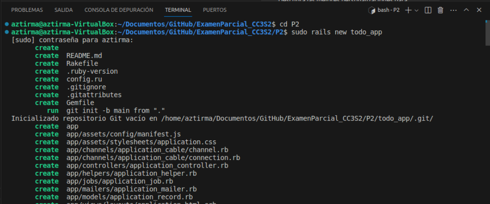
 
Si ejecutamos el comando ls, se podra ver el contenido


 Escribimos e ingresamos lo siguiente en el símbolo del sistema:

```
rails generate scaffold todo description:string
```
Lo cual nos da como salida lo siguiente:

 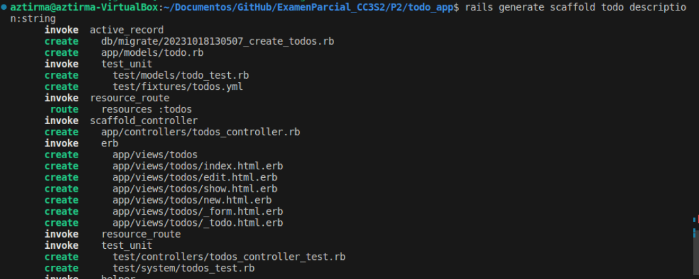

 **¿Qué está pasando aquí ?**

Como el comando se ejecutó correctamente, deberíamos ver una vez más una lista de resultados tanto para create <nombre de archivo> como para invoke <generator>

### Base de datos

Ya que tenemos nuestro modelo, procederemos a crear nuestra base de datos, con el siguiente comando:

```
bundle exec rake db:migrate
```
Como observamos, nos da el siguiente mensaje el cual significa que se creo exitosamente lo que deseabamos.

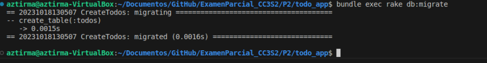


 **¿Qué está pasando aquí ?**
 
 Al ejecutar este comando, lo que la advertencia nos indica es que se creo exitosamente el Modelo Todos, es decir ya tenemos nuestra base de datos, en este momento vacia, con la cual podemos trabajar posteriormente.

Como mencionamos, ya que tenemos nuestra base de datos, insertaremos algunos registros:

 Para ello, abriremos db/seeds.rb en nuestro directorio
  
 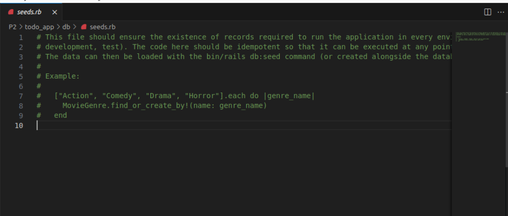
 
 luego pegamos las dos líneas siguientes en la parte inferior del archivo, debajo de los comentarios:

 ```
    Todo.create(description: "Hello CC3S2- Kids")
    Todo.create(description: " Do the assignments kid ")
```

 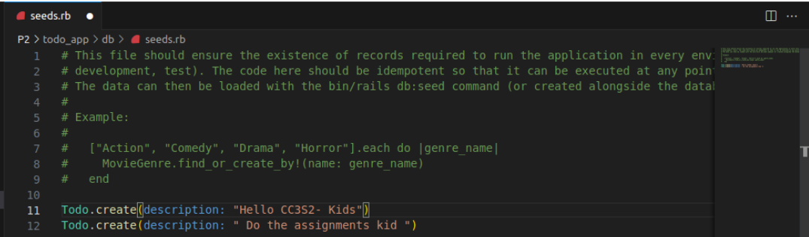

Para verificar que el modelo Todo esa definido correctamente ejecutamos la consola de rails, una vez en la consola, simplemente escribimos Todo.new. Esto debería crear una nueva instancia de la clase Movie con atributos nulos.

 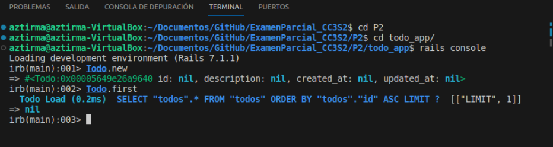


Después de agregar los datos iniciales a db/seeds.rb, ejecutamos el siguiente comando para llenar la base de datos con estos datos

 ```
 rake db:seeds
 ```

 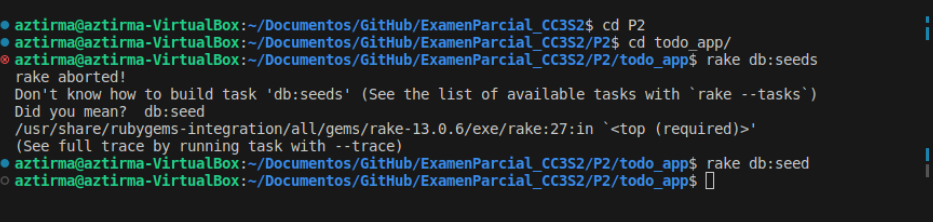

Ahora, podemos volver a la consola Rails ejecutando rails console y ejecutar Todo.all para verificar que las los datos anteriores se han agregado correctamente a la base de datos.


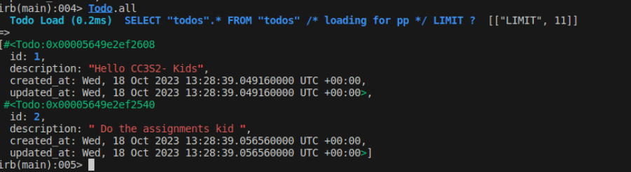

Ahora mostraremos todas las rutas generadas por Scaffold:


FALTA!!!!!!!!
Muestra todas las rutas generadas por el comando scaffold. Recomendamos realizar solicitudes a estas
rutas para que puedas ver cómo responde tu aplicación, tanto en términos de comportamiento visual
como de qué código se llama o se modifica.

### Mas migraciones

La primera migración nos permitió crear la base de datos. Digamos que el cliente quiere que cada "tareas pendientes" tenga una fecha de vencimiento asociada. **¿Cómo hacemos que eso suceda?** 

Generamos una nueva migracion, podria realizarse de la siguiente manera:

rails generate migration AddFechaVencimientoToTareasPendientes fecha_vencimiento:date

Esto generara un nuevo archivo de migracion, similar a lo realizado en lo anterior, leugo de haber generado la migracion con el nombre asociado a el, modificamos este mismo archivo con la informacion requerida, luego lo guardamos y ejecutamos la consola rails para poder ver si nuestros cambios tuvieron efecto.

### Nuevas rutas

Para agregar un nuevo servicio a nuestra aplicacion, pero si queremos acceder a el tenemos que crear una nueva ruta.

1. Agregamos una ruta en config/routes.rb y asígnamos a una acción del controlador.  

    ```
    get ’/hello’, to: ’todos#hello’
    ```

    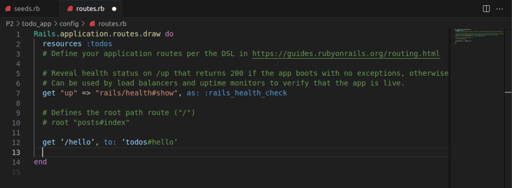

2. Añadimos una nueva vista correspondiente a la ruta. Para ello seguimos una serie de pasos, para poder modificar dicha vista.  
    • Creamos un archivo en el directorio app/views/todos llamado hello.html.erb.

    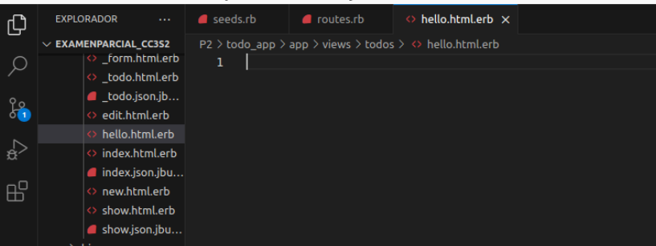

    • Por el momento el HTML permitido para esta actividad es:    
         
         <h1>¡Hola!</h1>.

    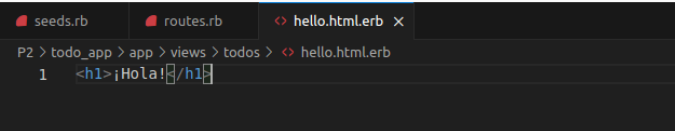

    • Agregamos el siguiente método `def hello` a app/controllers/todos_controller.rb.

    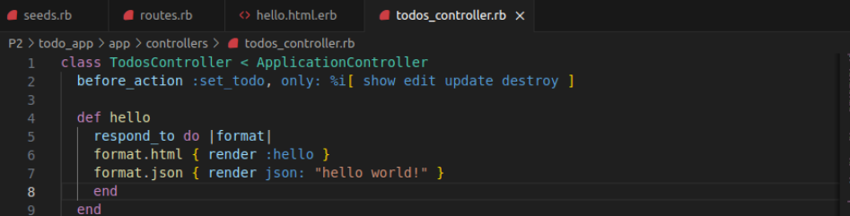

    Para comprobar si seguimos adecuantamente los pasos, ejecutamos rails server para corroborar que el mensaje aparezca al momento de acceder a nuestra ruta /hello

    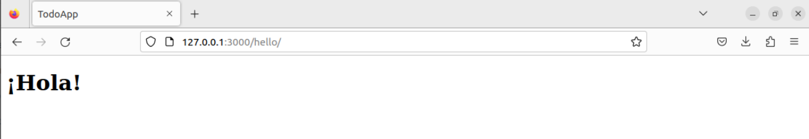

    ### Mas ejercicios:

    1. Agregamos un nuevo atributo al modelo Todo, agregando un nuevo campo booleano llamado "done" con un valor predeterminado de falso.

     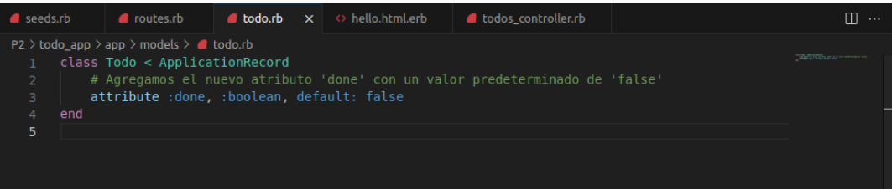

    2. Luego generamos la migración 

    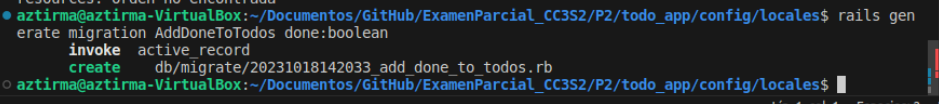

    3. Esto generará un nuevo archivo

    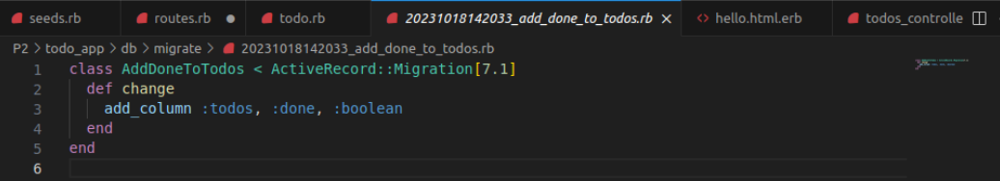

    4. Actualizamos la migración

    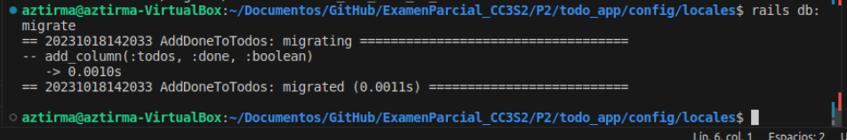

    5. Modificamos las vistas 

    
 ## Pregunta 3

 Se clono el repositorio exitosamente 

 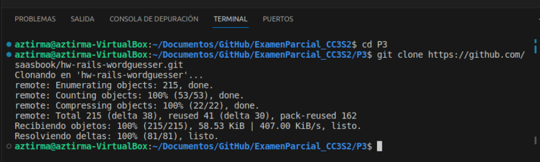

 Verificamos los archivos existentes dentro de nuestra carpeta:

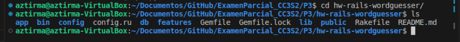


 ### Inicia el servidor 
 
 Preguntas (1 punto):  

• **¿Cuál es el objetivo de ejecutar bundle install?**
    El objetivo de bundle install es el de instalar las gemas necesarias las cuales son utilizadas para poder trabajar en nuestro proyecto. Por ejemplo, en nuestra aplicación wordguesser, debemos realizar la ejeacución de ese comando para poder interactuar con la aplicacion, pero se noto que no se llego a ejecutar el comando, puesto que habia incompatibilidades con la versión  de gemas que el proyecto proponia y con las versiones instaladas en nuestro ordenador. 
    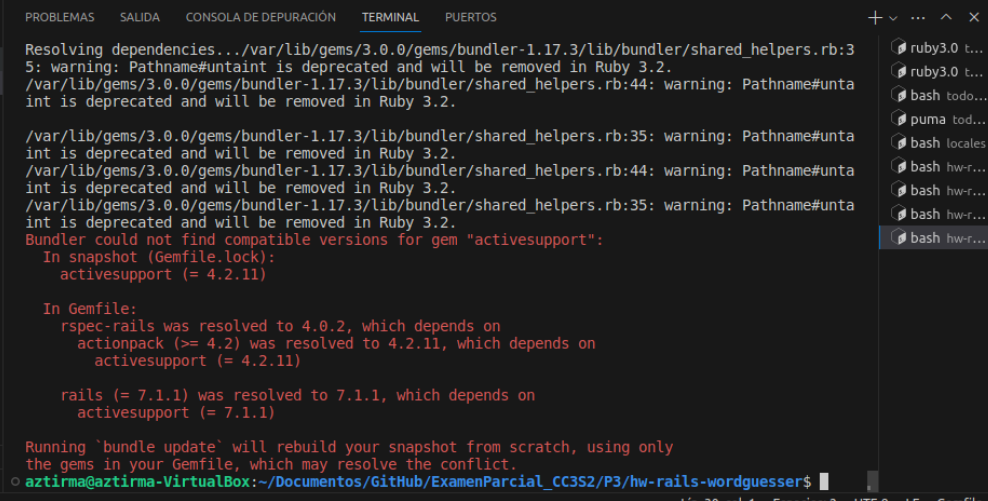

• ¿Por qué es una buena práctica especificar –without production al ejecutarlo en su
computadora de desarrollo?


Preguntas (3 puntos):  

• **¿En qué parte de la estructura del directorio de la aplicación Rails está el código
correspondiente al modelo WordGuesserGame?**

El código correspondiente al modelo se encuentra en el directorio app/models/word_guesser_game.rb

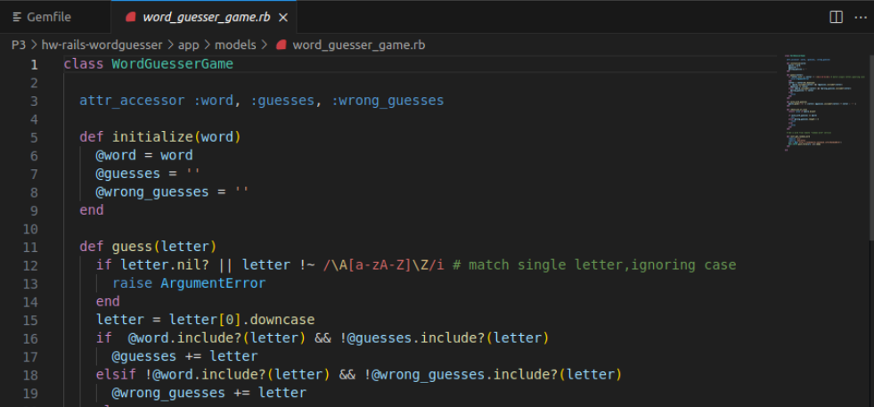

• ¿En qué archivo está el código que más se corresponde con la lógica del archivo app.rb de las aplicaciones Sinatra que maneja las acciones entrantes del usuario?  

El archivo que más se corresponde con la lógica del archivo app.rb, es decir o se podria decir su homologo en Rails sería el archivo `game_controller.rb`

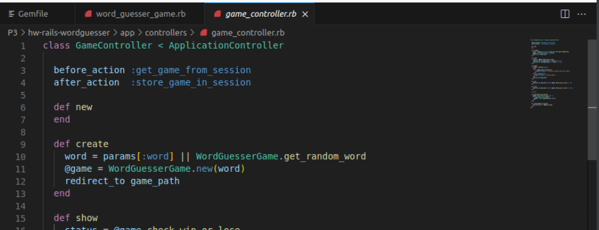

• ¿Qué clase contiene ese código?  

Esa clase contiene la clase GameController

• ¿De qué otra clase (que es parte del framework Rails) hereda esa clase?  


• ¿En qué directorio está el código correspondiente a las vistas de la aplicación Sinatra (new.erb,show.erb, etc.)?  

• Los sufijos de nombre de archivo para estas vistas son diferentes en Rails que en la aplicación Sinatra. ¿Qué información proporciona el sufijo situado más a la derecha del nombre del archivo (por ejemplo: en foobar.abc.xyz, el sufijo .xyz) sobre el contenido del archivo?  

• ¿Qué información te brinda el otro sufijo sobre lo que se le pide a Rails que haga con el archivo?  

• ¿En qué archivo está la información de la aplicación Rails que asigna rutas (por ejemplo, GET/new) a las acciones del controlador?  

• ¿Cuál es el papel de la opción :as => 'name' en las declaraciones de ruta de config/routes.rb? .  
 